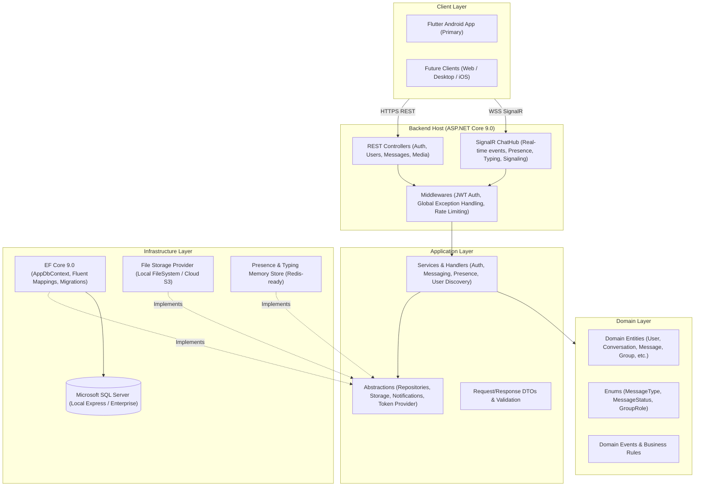

# Messenger System Architecture

## 1. Architectural Philosophy & Overview

Messenger is engineered as a production-grade, highly scalable, and modular real-time communication platform. It employs **Clean Architecture** on both the backend and client layers, maintaining strict separation of concerns, high testability, and zero tight coupling to external vendors, third-party libraries, or paid AI APIs.

### System Overview Diagram



---

## 2. Backend Clean Architecture (ASP.NET Core 9.0)

The solution follows a strict four-layer architecture partitioned into distinct projects:

### 2.1 `Messaging.Domain`
- **Responsibilities**: Pure domain models, core domain entities, value objects, domain logic, and enums.
- **Dependencies**: None (completely framework-agnostic).
- **Key Models**:
  - `User`, `UserProfile`, `UserSession`, `RefreshToken`
  - `Conversation`, `ConversationMember`, `Message`, `MessageStatusRecord`, `MessageReaction`, `MessageAttachment`
  - `Group`, `GroupMember`, `GroupRole`
  - `BlockedUser`, `Report`, `SavedMessage`, `PinnedMessage`

### 2.2 `Messaging.Application`
- **Responsibilities**: Business orchestration, use cases, service contracts, data transfer objects (DTOs), validation logic, and event definitions.
- **Dependencies**: `Messaging.Domain`.
- **Key Components**:
  - Service contracts (`IAuthService`, `IUserService`, `IMessageService`, `IConversationService`, `IStorageService`, `IPresenceService`)
  - Request/Response DTOs (e.g., `RegisterRequest`, `LoginRequest`, `SendMessageRequest`, `MessageDto`, `ConversationDto`)

### 2.3 `Messaging.Infrastructure`
- **Responsibilities**: Concrete implementations of external concerns, data access, database configuration, security hashing, token creation, and file system/cloud I/O.
- **Dependencies**: `Messaging.Application`, `Messaging.Domain`.
- **Key Components**:
  - `AppDbContext`: Entity Framework Core context with Fluent API configurations, composite indexes, and soft-delete filters.
  - `PasswordHasher`: Secure salted hashing (BCrypt / PBKDF2).
  - `JwtTokenService`: Signs and verifies JWT access tokens and generates cryptographically secure refresh tokens.
  - `LocalStorageService`: Handles file uploads, MIME type validation, GUID filename hashing, and secure streaming.
  - `InMemoryPresenceTracker`: Low-overhead thread-safe concurrent tracker for real-time user online/offline presence and typing state (designed for seamless migration to Redis distributed cache).

### 2.4 `Messaging.Api`
- **Responsibilities**: Presentation layer exposing HTTP REST endpoints, hosting the real-time SignalR hub, configuring dependency injection, and middleware orchestration.
- **Dependencies**: `Messaging.Application`, `Messaging.Infrastructure`.
- **Key Components**:
  - Controllers (`AuthController`, `UsersController`, `ConversationsController`, `MessagesController`, `MediaController`)
  - SignalR Hub (`ChatHub`): Manages bi-directional duplex communication for messages, status receipts, typing indicators, presence, and call signaling.
  - Global Exception Handling Middleware: Consistent RFC 7807 ProblemDetails and error formatting.
  - Swagger / OpenAPI documentation with Bearer authentication scheme.

---

## 3. Real-Time Communication Model (SignalR)

SignalR enables persistent, low-latency, full-duplex communication over WebSockets with automatic fallback to Server-Sent Events or Long Polling.

### Hub Security & Identity
- Clients must authenticate using their JWT access token (passed via query parameter `access_token` during WebSocket handshake or standard `Authorization: Bearer <token>` header).
- Client-provided user identifiers are **never** trusted; the user identity is resolved strictly from the authenticated `ClaimsPrincipal` (`sub` / `UserId` claim).

### Hub Events Matrix

| Event Name | Direction | Payload | Description |
|---|---|---|---|
| `SendMessage` | Client → Server | `SendMessageRequest` | Transmit new message to conversation |
| `MessageReceived` | Server → Client | `MessageDto` | Broadcast received message to participants |
| `MessageDelivered` | Server → Client | `{ messageId, conversationId, userId, timestamp }` | Delivery receipt confirmation |
| `MessageRead` | Server → Client | `{ messageId, conversationId, userId, timestamp }` | Read receipt confirmation |
| `TypingStarted` | Client → Server | `{ conversationId }` | User started typing |
| `UserTyping` | Server → Client | `{ conversationId, userId, username }` | Broadcast typing indicator to conversation |
| `TypingStopped` | Client → Server | `{ conversationId }` | User stopped typing |
| `UserStoppedTyping` | Server → Client | `{ conversationId, userId }` | Clear typing indicator |
| `PresenceChanged` | Server → Client | `{ userId, isOnline, lastSeen }` | Presence status transition notification |
| `ReactionAdded` | Server → Client | `{ messageId, userId, emoji }` | Emoji reaction update |
| `MessageUpdated` | Server → Client | `MessageDto` | Edited message broadcast |
| `MessageDeleted` | Server → Client | `{ messageId, deleteForEveryone }` | Deleted message broadcast |

---

## 4. Mobile Frontend Architecture (Flutter)

The Flutter mobile client (`messaging_app`) employs Clean Architecture with feature-based encapsulation.

```
messaging_app/
├── lib/
│   ├── core/
│   │   ├── config/          # Environment configuration & API URLs
│   │   ├── constants/       # Design tokens, colors, dimensions, endpoints
│   │   ├── errors/          # Custom exceptions, failure classes
│   │   ├── network/         # Http client wrapper, SignalR hub connection manager
│   │   ├── storage/         # Local secure token storage & preferences
│   │   ├── theme/           # Material 3 Light/Dark adaptive color schemes
│   │   ├── utils/           # Formatters, debouncers, validators
│   │   └── widgets/         # Shared UI components (Avatar, Badges, Buttons)
│   └── features/
│       ├── auth/            # Login, registration, token refresh UI & state
│       ├── users/           # User discovery, search, user profiles
│       ├── chats/           # Chat list, conversation filters, pinning, archiving
│       ├── messages/        # Real-time chat screen, bubbles, composer, status ticks
│       ├── groups/          # Group creation, management, participant lists
│       ├── media/           # Image viewer, document picker, voice recorder
│       └── settings/        # Privacy controls, notifications, themes
```

---

## 5. Security & Safety Architecture

1. **Authentication**: Stateless JWT access tokens (short-lived, 60 minutes) combined with rotatable cryptographic refresh tokens stored in SQL Server with device/IP tracking.
2. **Authorization**: All conversation and message operations strictly verify that the authenticated caller is an active participant or group member with sufficient privileges.
3. **Password Security**: Salted hashing with work factor scaling (BCrypt).
4. **File Safety**: Uploaded files undergo MIME type verification against magic bytes, strict extension whitelisting, randomized GUID disk filenames, and size quota enforcement.
5. **Database Isolation**: Parameterized queries via EF Core preventing SQL injection; global query filters handling soft deletes and privacy blocks.
