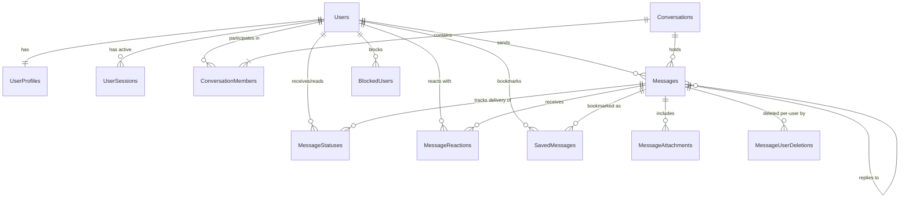

# Messenger Database Design & Schema Specification

## 1. Overview & Technology

The Messenger relational database is designed for **Microsoft SQL Server (2019/2022/2025/Express)** and managed via **Entity Framework Core 9.0** Code-First migrations with Fluent API configurations.

### Key Database Design Principles:
1. **Immutable Internal Identifier**: Primary identity across all relational tables is a unique `GUID` (`uniqueidentifier`). The public `@username` is strictly an indexed, case-insensitive discovery identifier.
2. **High Concurrency & Read Scalability**: Heavy read queries (e.g., retrieving recent conversation messages, chat list previews) are supported by tailored composite indexes with covering columns.
3. **Auditability & Soft Deletion**: Messages and conversations are never destructively purged when an audit trail or per-user deletion state is required.
4. **Multi-device Session Storage**: Distinct user sessions and cryptographic refresh tokens are explicitly persisted and tracked per device.

---

## 2. Entity Relationship Diagram (ERD)

---

## 3. Detailed Table Schema Definitions

### 3.1 `Users` (Core Identity)
Primary authentication and account status entity.

| Column | Type | Constraints | Description |
|---|---|---|---|
| `Id` | `uniqueidentifier` | `PK, Non-Clustered` | Immutable internal user GUID |
| `Username` | `nvarchar(30)` | `NOT NULL, UNIQUE` | Case-insensitive discovery handle (e.g., `@atharv`) |
| `Email` | `nvarchar(256)` | `NOT NULL, UNIQUE` | Account email address |
| `PasswordHash` | `nvarchar(255)` | `NOT NULL` | BCrypt/PBKDF2 salted password hash |
| `IsActive` | `bit` | `NOT NULL, DEFAULT 1` | Whether account is active |
| `IsEmailVerified` | `bit` | `NOT NULL, DEFAULT 0`| Email verification status |
| `CreatedAtUtc` | `datetime2` | `NOT NULL` | Account registration timestamp (UTC) |
| `UpdatedAtUtc` | `datetime2` | `NULL` | Last account modification timestamp |

*Indexes*:
- `IX_Users_Username` (Unique, Case-insensitive collation `SQL_Latin1_General_CP1_CI_AS`)
- `IX_Users_Email` (Unique)

---

### 3.2 `UserProfiles` (Public Profile & Privacy Settings)
Profile metadata, presence snapshots, and privacy configurations.

| Column | Type | Constraints | Description |
|---|---|---|---|
| `UserId` | `uniqueidentifier` | `PK, FK -> Users(Id)` | One-to-one link to Users table |
| `DisplayName` | `nvarchar(100)` | `NOT NULL` | Human-friendly name (e.g., "Atharv Gujare") |
| `Bio` | `nvarchar(500)` | `NULL` | Short biography or status text |
| `AvatarUrl` | `nvarchar(1024)` | `NULL` | Relative or cloud storage URL to avatar image |
| `LastSeenAtUtc` | `datetime2` | `NULL` | Timestamp of last user activity |
| `IsOnline` | `bit` | `NOT NULL, DEFAULT 0` | Current presence status |
| `LastSeenPrivacy` | `tinyint` | `NOT NULL, DEFAULT 0` | 0: Everyone, 1: Contacts, 2: Nobody |
| `AvatarPrivacy` | `tinyint` | `NOT NULL, DEFAULT 0` | 0: Everyone, 1: Contacts, 2: Nobody |
| `ReadReceiptsEnabled`| `bit` | `NOT NULL, DEFAULT 1` | Global read receipts preference |
| `TypingIndicatorEnabled`| `bit` | `NOT NULL, DEFAULT 1` | Global typing indicator preference |

---

### 3.3 `UserSessions` (Multi-Device Refresh Tokens)
Persisted tokens for multi-device authentication and session revocation.

| Column | Type | Constraints | Description |
|---|---|---|---|
| `Id` | `uniqueidentifier` | `PK` | Unique session record ID |
| `UserId` | `uniqueidentifier` | `FK -> Users(Id), NOT NULL` | Owning user |
| `RefreshToken` | `nvarchar(255)` | `NOT NULL, UNIQUE` | Cryptographically random secure token |
| `DeviceInfo` | `nvarchar(255)` | `NULL` | Client device identifier or user-agent |
| `IpAddress` | `nvarchar(45)` | `NULL` | Originating IP address |
| `ExpiresAtUtc` | `datetime2` | `NOT NULL` | Token expiration timestamp |
| `CreatedAtUtc` | `datetime2` | `NOT NULL` | Session creation timestamp |
| `RevokedAtUtc` | `datetime2` | `NULL` | Timestamp when session was revoked/logged out |
| `ReplacedByToken`| `nvarchar(255)` | `NULL` | For token rotation auditing |

*Indexes*:
- `IX_UserSessions_UserId_ExpiresAtUtc`
- `IX_UserSessions_RefreshToken` (Unique)

---

### 3.4 `Conversations` (Direct & Group Chats)
Represents a messaging thread between two or more participants.

| Column | Type | Constraints | Description |
|---|---|---|---|
| `Id` | `uniqueidentifier` | `PK` | Unique conversation ID |
| `Type` | `tinyint` | `NOT NULL` | 1: Direct (1-to-1), 2: Group, 3: SavedMessages |
| `Title` | `nvarchar(150)` | `NULL` | Group name (null for direct chats) |
| `Description` | `nvarchar(500)` | `NULL` | Group description |
| `AvatarUrl` | `nvarchar(1024)` | `NULL` | Group avatar URL |
| `CreatedByUserId`| `uniqueidentifier` | `FK -> Users(Id), NULL` | Conversation creator |
| `CreatedAtUtc` | `datetime2` | `NOT NULL` | Creation timestamp |
| `UpdatedAtUtc` | `datetime2` | `NOT NULL` | Timestamp of latest activity |
| `LastMessageId` | `uniqueidentifier` | `NULL` | Fast preview pointer to latest message |

---

### 3.5 `ConversationMembers` (Thread Membership & Preferences)
Links users to conversations with customized settings (pinning, muting, archiving).

| Column | Type | Constraints | Description |
|---|---|---|---|
| `ConversationId` | `uniqueidentifier` | `PK, FK -> Conversations(Id)` | Conversation reference |
| `UserId` | `uniqueidentifier` | `PK, FK -> Users(Id)` | User reference |
| `Role` | `tinyint` | `NOT NULL, DEFAULT 3` | 1: Owner, 2: Admin, 3: Member |
| `JoinedAtUtc` | `datetime2` | `NOT NULL` | Timestamp when member joined |
| `IsMuted` | `bit` | `NOT NULL, DEFAULT 0` | Notifications muted toggle |
| `IsPinned` | `bit` | `NOT NULL, DEFAULT 0` | Pinned to top of chat list |
| `IsArchived` | `bit` | `NOT NULL, DEFAULT 0` | Moved to archive folder |
| `LastReadMessageId`| `uniqueidentifier`| `NULL` | Watermark of last message read |
| `LastReadAtUtc` | `datetime2` | `NULL` | Timestamp of last read activity |

*Indexes*:
- `IX_ConversationMembers_UserId_IsArchived_IsPinned` (Optimized for home screen chat list query)

---

### 3.6 `Messages` (Core Chat Content)
Unified message store supporting text, media, voice, replies, and edits.

| Column | Type | Constraints | Description |
|---|---|---|---|
| `Id` | `uniqueidentifier` | `PK` | Message unique identifier |
| `ConversationId` | `uniqueidentifier` | `FK -> Conversations(Id), NOT NULL` | Target conversation |
| `SenderId` | `uniqueidentifier` | `FK -> Users(Id), NOT NULL` | Message author |
| `Type` | `tinyint` | `NOT NULL, DEFAULT 1` | 1: Text, 2: Image, 3: Video, 4: File, 5: Voice, 6: Location, 7: Contact, 8: System |
| `Content` | `nvarchar(max)` | `NULL` | Text body or caption |
| `ReplyToMessageId`| `uniqueidentifier`| `FK -> Messages(Id), NULL` | Parent message ID for quoted replies |
| `CreatedAtUtc` | `datetime2` | `NOT NULL` | Send timestamp |
| `UpdatedAtUtc` | `datetime2` | `NULL` | Edit timestamp |
| `IsEdited` | `bit` | `NOT NULL, DEFAULT 0` | Flag indicating message was edited |
| `IsDeletedForEveryone`| `bit` | `NOT NULL, DEFAULT 0` | Global soft-delete flag |
| `ForwardCount` | `int` | `NOT NULL, DEFAULT 0` | Count of times forwarded |

*Indexes*:
- `IX_Messages_ConversationId_CreatedAtUtc` (Clustered or Covering index for conversation pagination)
- `IX_Messages_SenderId`

---

### 3.7 `MessageStatuses` (Delivery & Read Tracking)
Tracks delivery and read state per recipient.

| Column | Type | Constraints | Description |
|---|---|---|---|
| `Id` | `bigint IDENTITY` | `PK` | Status event record ID |
| `MessageId` | `uniqueidentifier` | `FK -> Messages(Id), NOT NULL` | Referenced message |
| `UserId` | `uniqueidentifier` | `FK -> Users(Id), NOT NULL` | Recipient user |
| `Status` | `tinyint` | `NOT NULL` | 1: Sent, 2: Delivered, 3: Read |
| `TimestampUtc` | `datetime2` | `NOT NULL` | When status transition occurred |

*Indexes*:
- `IX_MessageStatuses_MessageId_UserId` (Unique composite)

---

### 3.8 `MessageAttachments` (Media & Document Metadata)
Separates binary file storage metadata from relational message bodies.

| Column | Type | Constraints | Description |
|---|---|---|---|
| `Id` | `uniqueidentifier` | `PK` | Attachment ID |
| `MessageId` | `uniqueidentifier` | `FK -> Messages(Id), NOT NULL` | Owning message |
| `FileName` | `nvarchar(255)` | `NOT NULL` | Original sanitized file name |
| `StorageKey` | `nvarchar(500)` | `NOT NULL` | Relative disk path or cloud storage key |
| `ContentType` | `nvarchar(100)` | `NOT NULL` | Validated MIME type (e.g. `image/jpeg`) |
| `FileSizeBytes` | `bigint` | `NOT NULL` | File size in bytes |
| `FileHashSha256` | `nvarchar(64)` | `NOT NULL` | SHA-256 integrity hash |
| `DurationSeconds`| `int` | `NULL` | Audio/video duration |
| `ThumbnailUrl` | `nvarchar(1024)` | `NULL` | Optional low-res preview image |

---

### 3.9 `MessageReactions`
Emoji reactions attached to messages.

| Column | Type | Constraints | Description |
|---|---|---|---|
| `MessageId` | `uniqueidentifier` | `PK, FK -> Messages(Id)` | Referenced message |
| `UserId` | `uniqueidentifier` | `PK, FK -> Users(Id)` | Reacting user |
| `Emoji` | `nvarchar(16)` | `NOT NULL` | Unicode emoji character |
| `CreatedAtUtc` | `datetime2` | `NOT NULL` | Timestamp of reaction |

---

### 3.10 `MessageUserDeletions` (Delete for Me)
Tracks per-user local message deletions without affecting other participants.

| Column | Type | Constraints | Description |
|---|---|---|---|
| `MessageId` | `uniqueidentifier` | `PK, FK -> Messages(Id)` | Deleted message |
| `UserId` | `uniqueidentifier` | `PK, FK -> Users(Id)` | User who hid/deleted the message |
| `DeletedAtUtc` | `datetime2` | `NOT NULL` | Timestamp of deletion |

---

### 3.11 `BlockedUsers` & `Reports` (Safety & Moderation)
Enforces backend security against harassment and spam.

| Table | Primary Columns | Purpose |
|---|---|---|
| `BlockedUsers` | `BlockerId`, `BlockedId`, `CreatedAtUtc` | Prevents message dispatch and presence disclosure |
| `Reports` | `Id`, `ReporterId`, `ReportedUserId`, `MessageId`, `Reason`, `Status` | Moderation queue for abusive accounts/messages |

---

## 4. Migration & Maintenance Strategy

- **EF Core Migrations**: All schema modifications are authored using migrations in `Messaging.Infrastructure` and verified against a local SQL Server Express instance (`localhost\SQLEXPRESS`).
- **No Direct Table Modification**: Manual SQL schema mutations are prohibited to maintain reproducible environment setups.
- **Connection String**: Loaded dynamically from `appsettings.json` / environment variables.
